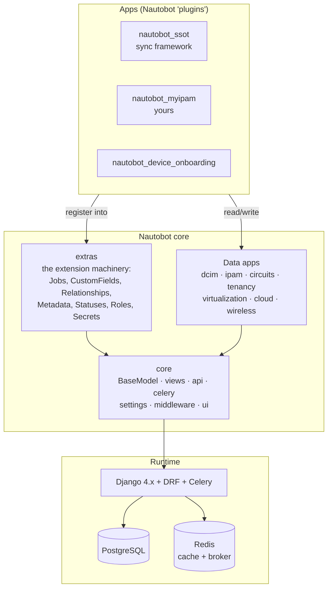
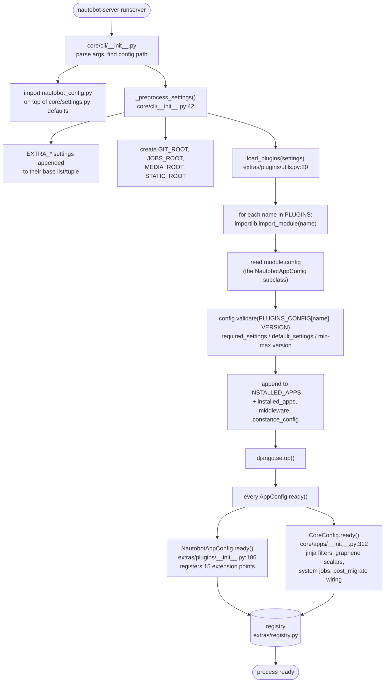
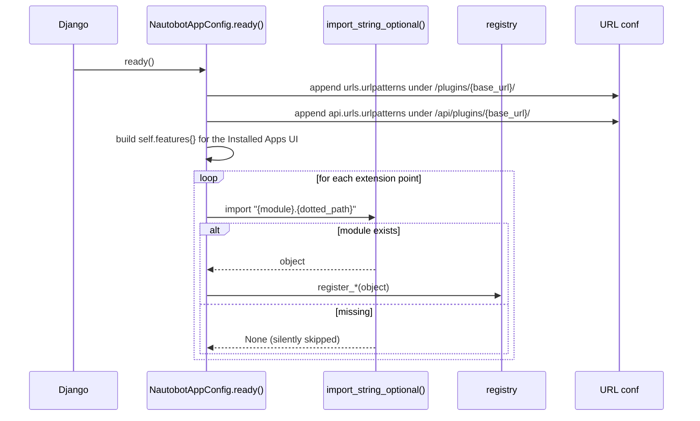
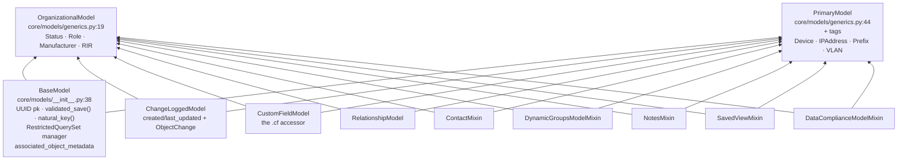
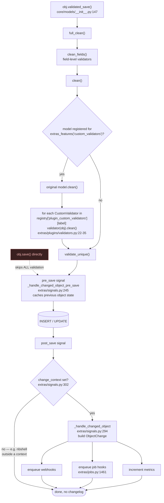
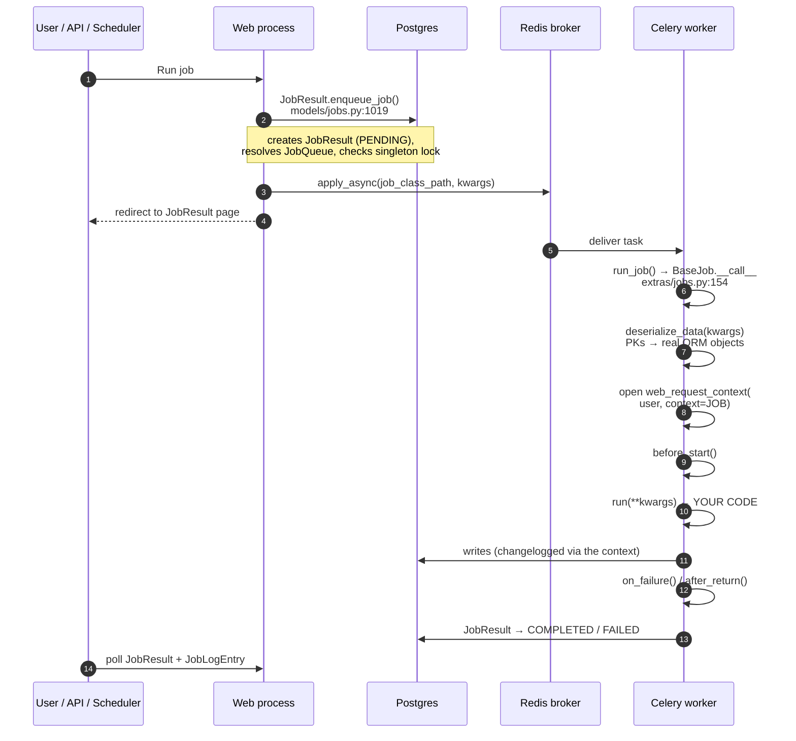
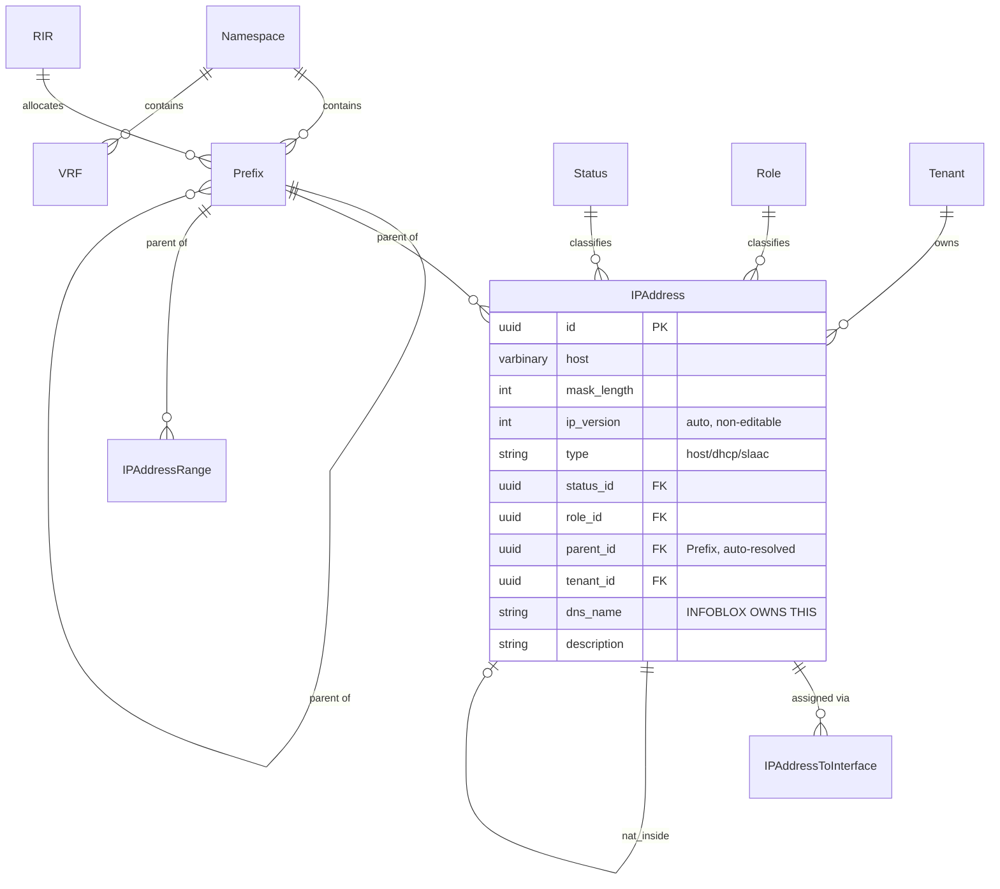
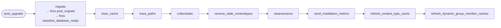
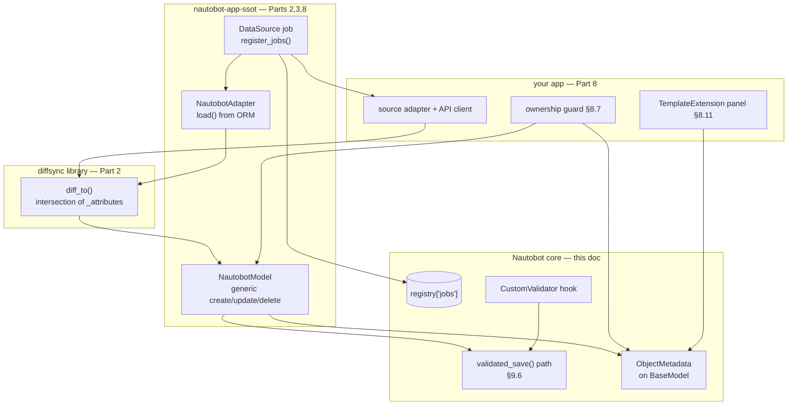

# Part 9: How Nautobot Actually Works

The background mechanics every other doc in this set assumes you already know: how the
server boots, how apps get loaded, what happens between `obj.save()` and a row hitting
Postgres, how jobs reach a worker, and where an app is allowed to intervene.

Read this **before** 01–08 if you are new to Nautobot. Read §9.6 (the save path) before
writing any sync code — it is where ownership, validation, and change logging all meet.

Verified 2026-08-22 against nautobot 3.2.4a0 (`../nautobot/`, branch `develop`). Paths
below are relative to `nautobot/` inside that checkout, e.g. `core/settings.py` means
`../nautobot/nautobot/core/settings.py`.

---

## 9.1 Orientation — what Nautobot is

Nautobot is a Django project with a strong opinion about how models, views, and APIs
should be built, plus an extension system that lets third-party packages register into
almost every layer. Nothing more exotic than that.



Three facts that shape everything else:

1. **`extras` is the extension layer.** Custom fields, relationships, metadata, jobs,
   statuses, secrets, webhooks, and the whole app system live there. When you wonder
   "how do I attach X to a core model without forking it", the answer is in `extras`.
2. **Every model's primary key is a UUID**, generated in Python at instantiation, not by
   the database (`core/models/__init__.py:56`). So `self.pk is None` is **never** a
   reliable "is this new?" test — use `self.present_in_database`. This trips up everyone
   coming from stock Django.
3. **There is no diff or sync logic anywhere in core.** That lives in `diffsync` and
   `nautobot-app-ssot` (Part 1). Core gives you models and hooks; synchronisation is an
   app concern.

---

## 9.2 Startup — from `nautobot-server` to a ready process

The single most useful thing to understand, because it explains why `PLUGINS` is a
settings list rather than an entry point, and why some things must be done in
`ready()` and others in a post-migrate signal.



### What `load_plugins` actually does

`extras/plugins/utils.py:26-89`, in order — each step can fail your boot:

| Step | Failure you will see |
|---|---|
| `importlib.import_module(plugin_name)` | `PluginNotFound` — installed into the wrong virtualenv |
| `plugin.config` lookup | `PluginImproperlyConfigured` — you forgot `config = MyAppConfig` in `__init__.py` |
| `plugin_config.validate(...)` | missing `required_settings`, or a Nautobot version outside `min_version`/`max_version` |
| append to `INSTALLED_APPS` | — |
| merge `installed_apps`, `middleware`, `constance_config` | — |

**This is why there is no entry-point autodiscovery.** App loading is driven entirely by
the `PLUGINS` list, read from settings *before* Django starts, because the list has to
mutate `INSTALLED_APPS` and `MIDDLEWARE` before `django.setup()`. Installing the wheel
without editing `nautobot_config.py` does exactly nothing (Part 7 §7.1).

### The `EXTRA_*` convention

Any setting named `EXTRA_<NAME>` where `<NAME>` is an existing list/tuple setting gets
**appended** to it (`core/cli/__init__.py:55-67`). So:

```python
EXTRA_INSTALLED_APPS = ["my_django_app"]   # appends, does not replace
INSTALLED_APPS = ["my_django_app"]         # REPLACES the entire core list — breaks everything
```

Use `EXTRA_` for lists. For dicts there is no such helper — overriding one wholesale
replaces it, which is the `LOGGING` trap from Part 1 (`core/settings.py:1364`).

---

## 9.3 The registry

A dict subclass with two rules: a store cannot be redefined once created, and stores can
never be deleted (`extras/registry.py:5-23`). Everything an app registers ends up here,
and this is the thing to inspect when a feature "isn't showing up".

```python
# extras/registry.py:26-30 — initial stores
registry = Registry(
    datasource_contents=defaultdict(list),
    secrets_providers={},
    job_modal_buttons={},
)
```

Other stores are created as modules import. The ones you will care about:

| Store | Created at | Holds |
|---|---|---|
| `plugin_custom_validators` | `extras/plugins/__init__.py:33` | model label → list of `CustomValidator` |
| `plugin_template_extensions` | `extras/plugins/__init__.py:35` | model label → list of `TemplateExtension` |
| `plugin_banners`, `plugin_graphql_types` | `extras/plugins/__init__.py:32,34` | — |
| `app_metrics` | `extras/plugins/__init__.py:36` | Prometheus collectors |
| `model_features` / `feature_models` | `extras/utils.py:351-354` | which models opted into which `extras_features` |
| `jobs` | `core/celery/__init__.py:335` | class_path → Job class |
| `nav_menu`, `homepage_layout` | `core/apps/__init__.py` | UI structure |

Debugging tip — from `nautobot-server nbshell`:

```python
from nautobot.extras.registry import registry
registry["plugin_custom_validators"]["ipam.ipaddress"]     # is my validator registered?
registry["plugin_template_extensions"]["ipam.ipaddress"]   # is my panel registered?
list(registry["jobs"])                                     # is my job importable?
```

If your feature is missing here, the problem is registration (a bad dotted path, an import
error swallowed by `import_string_optional`), not the feature's own code.

---

## 9.4 App loading in detail — the 15 extension points

`NautobotAppConfig.ready()` (`extras/plugins/__init__.py:106-228`) resolves a dotted path
per feature and registers whatever it finds. Every path is **optional** — a missing module
is silently skipped, which is exactly why a typo'd filename produces no error and no
feature.



The full table — attribute name, its default path, and what it does
(`extras/plugins/__init__.py:90-104` for the defaults, `:145-228` for the registration):

| AppConfig attribute | Default module path | Registers |
|---|---|---|
| `banner_function` | `banner.banner` | a site-wide banner |
| `custom_validators` | `custom_validators.custom_validators` | save-time validation on **any** model |
| `datasource_contents` | `datasources.datasource_contents` | Git repository content types |
| `graphql_types` | `graphql.types.graphql_types` | GraphQL object types |
| `jobs` | `jobs.jobs` | imported, but **you** must call `register_jobs()` |
| `metrics` | `metrics.metrics` | Prometheus collectors |
| `menu_items` | `navigation.menu_items` | nav menu entries |
| `homepage_layout` | `homepage.layout` | homepage panels |
| `template_extensions` | `template_content.template_extensions` | panels/tabs/buttons on **core** detail pages |
| `jinja_filters` | `jinja_filters` | Jinja2 filters |
| `secrets_providers` | `secrets.secrets_providers` | new secret backends |
| `filter_extensions` | `filter_extensions.filter_extensions` | extra filters on **core** models |
| `table_extensions` | `table_extensions.table_extensions` | extra columns on **core** tables |
| `override_views` | `views.override_views` | replace a core view outright |
| `constance_config` | *(attribute, not a module)* | runtime-editable settings |

Note the comment at line 164: jobs are imported but **not** auto-registered — your
`jobs.py` must call `register_jobs(*jobs)` itself. Forgetting this is the single most
common "my job doesn't appear" cause.

URL namespacing is derived here too: your views live at `/plugins/{base_url}/` with
namespace `plugins:{app_label}:...`, and your API at `/api/plugins/{base_url}/` with
namespace `plugins:{app_label}-api:...` (`:113-122`).

---

## 9.5 The model layer

Every Nautobot model inherits `BaseModel`; most inherit one of two composites.



**The only structural difference between the two is `tags`** — `PrimaryModel` has a
`TagsField`, `OrganizationalModel` does not (`core/models/generics.py:44-66`). The rest is
semantics: primary models are things on the network (Device, IPAddress, Prefix);
organizational models categorise them (Status, Role, RIR, Manufacturer).

What `BaseModel` gives you for free (`core/models/__init__.py:38-90`):

- **UUID primary key**, Python-generated. Use `present_in_database`, not `pk is None`.
- **`validated_save()`** — `full_clean()` then `save()` (`:147-161`). Nautobot convention
  is to always use this in jobs and scripts; plain `.save()` skips validation entirely.
- **`objects = BaseManager.from_queryset(RestrictedQuerySet)()`** — enables `.restrict(user)`
  for object-level permissions (§9.7).
- **`associated_object_metadata`** — the `GenericRelation` to `ObjectMetadata` that the
  whole provenance story in Parts 3 and 8 depends on. It is on `BaseModel`, so **every**
  model can carry metadata (`is_metadata_associable_model = True` by default, line 63).

### `extras_features` — opting into extension features

```python
@extras_features("custom_links", "custom_validators", "export_templates", "graphql", "webhooks")
class MyModel(PrimaryModel):
    ...
```

The decorator just appends to two registry stores (`extras/utils.py:344-364`). Valid
features are fixed at `extras/constants.py:5-21`: `cable_terminations`,
`config_context_owners`, `custom_fields`*, `custom_links`, `custom_validators`,
`dynamic_groups`, `export_template_owners`, `export_templates`, `graphql_query_owners`,
`graphql`, `job_results`*, `locations`, `relationships`*, `statuses`, `webhooks`
(*deprecated or unused). Anything else raises `ValueError` at import.

**`custom_validators` in that list is what makes your model eligible to be validated** —
see the next section.

---

## 9.6 The save path — the most important diagram in this doc

This is where validation, app-supplied invariants, change logging, webhooks, and job hooks
all attach. If you are building anything about ownership or conflict avoidance, this is
your map.



### Three consequences worth internalising

**1. `CustomValidator` is the only hook nothing can bypass.** Nautobot monkey-patches
`clean()` on every model registered for the `custom_validators` feature
(`extras/plugins/validators.py:39-46`):

```python
# extras/plugins/validators.py:39-46
def wrap_model_clean_methods():
    for app_label, models in FeatureQuery("custom_validators").as_dict():
        for model in models:
            model_class = apps.get_model(app_label=app_label, model_name=model)
            model_class.clean = custom_validator_clean(model_class)
```

Every writer that reaches `full_clean()` — UI form, REST API, GraphQL mutation, a Job, or
another app entirely — runs your validator. That is why Part 8 §8.7 recommends it as the
last line of defence for field ownership: you cannot be routed around.

The catch is in the same file at line 32: a validator whose `clean` is not overridden is
skipped. And the wrapping happens once at startup, so a model **not** decorated with
`@extras_features("custom_validators")` can never be validated by an app, no matter what
you register.

**2. Change logging depends on an ambient context, not on the save itself.** If
`change_context_state` is unset, `_handle_changed_object` returns early
(`extras/signals.py:302-305`) and **no `ObjectChange` is written**. The context is set by:

- `ObjectChangeMiddleware` for every web request (`core/middleware.py:131-152`)
- `web_request_context(...)` inside `BaseJob.__call__` for every job run
  (`extras/jobs.py:170`)

So a script run under `nbshell` that calls `validated_save()` outside a context saves the
row and writes **no changelog entry**. Not a bug — a deliberate design — but it surprises
people auditing "why is this change untracked".

**3. `.save()` is not `validated_save()`.** Plain `.save()` skips `full_clean()`, which
skips your validators entirely. Nautobot's own convention is `validated_save()` everywhere
outside performance-critical bulk paths, and `NautobotModel` in the SSoT contrib layer
uses it too.

---

## 9.7 The request lifecycle

```mermaid
flowchart LR
    REQ([HTTP request]) --> MW1["SessionMiddleware<br/>CsrfViewMiddleware<br/>AuthenticationMiddleware"]
    MW1 --> MW2["ExceptionHandlingMiddleware<br/>core/middleware.py:155"]
    MW2 --> MW3["RequestCacheMiddleware<br/>:113 per-request cache"]
    MW3 --> MW4["RemoteUser / ExternalAuth<br/>SSO backends"]
    MW4 --> MW5["ObjectChangeMiddleware<br/>:113 opens web_request_context"]
    MW5 --> V["View / ViewSet"]

    V --> QS["Model.objects.restrict(request.user, 'view')<br/>core/models/querysets.py:112"]
    QS --> PERM{"superuser or<br/>exempt?"}
    PERM -->|yes| ALL["full queryset"]
    PERM -->|"not authenticated<br/>or lacks perm"| NONE["empty queryset"]
    PERM -->|"has perm"| CONSTR["filter by ObjectPermission<br/>constraints, $user tokens"]

    ALL --> RESP([Response])
    NONE --> RESP
    CONSTR --> RESP
    RESP --> CLOSE["context exits →<br/>ObjectChanges flushed"]
```



The middleware order is fixed at `core/settings.py:693-712`. Two entries matter to app
authors:

- **`ObjectChangeMiddleware`** wraps the *entire* request in `web_request_context`, so
  every save during that request gets attributed to `request.user` and logged. It
  deliberately skips health-check requests to avoid exhausting DB connections
  (`core/middleware.py:139-142`).
- **`RequestCacheMiddleware`** gives you a per-request cache — useful if your
  `TemplateExtension` or `CustomValidator` would otherwise re-query on every object in a
  list view.

### Permissions

`restrict()` (`core/models/querysets.py:112-145`) builds the permission string as
`{app_label}.{action}_{model_name}` and then does one of three things: pass everything
through for superusers and exempt views, return `.none()` for users lacking the
permission, or apply the constraint filters attached to the user's `ObjectPermission`
records. Constraints support a `$user` token, so rules like "only objects in my tenant"
are expressible without code.

For your app, `app_label` is your package name — which is why renaming a package after
release breaks every permission assignment in every deployment (Part 6 §6.0.1).

---

## 9.8 Jobs and Celery

Jobs are how Nautobot runs anything long — including every SSoT sync.



Key details:

- **Job classes are registered in-process, not in the DB.** `register_jobs()` fills
  `registry["jobs"]` keyed by `class_path` (`core/celery/__init__.py:340-346`). The `Job`
  **database** records are synced from that registry by `refresh_job_models`, which runs
  on the `nautobot_database_ready` signal (`extras/signals.py:766`) — i.e. at
  `post_upgrade`. **A newly added job does not appear until you run `post_upgrade`** (or
  otherwise trigger the refresh).
- **Arguments are serialized.** `deserialize_data` turns stored PKs back into ORM objects
  at execution time (`extras/jobs.py:159-164`), and fails the job if an object has since
  been deleted. This is why an `ObjectVar` in a scheduled job can fail hours later.
- **Jobs run in the worker process**, not the web process. Your app must be installed in
  the worker image, and code changes need a worker restart (Part 7 §7.1).
- **`Meta` controls behaviour** (`extras/jobs.py:132-148`): `name`, `description`,
  `has_sensitive_variables`, `soft_time_limit`, `time_limit`, `task_queues`,
  `is_singleton`, `dryrun_default`, `hidden`, `field_order`.
- **Lifecycle hooks** you can override: `before_start`, `run`, `on_failure`,
  `after_return` (`extras/jobs.py:202-280`). SSoT's `DataSyncBaseJob` uses `run` to drive
  the load → diff → sync pipeline (Part 8 §8.4).

---

## 9.9 The IPAM data model

Directly relevant to this project, and it has a trap that will bite any IPAM sync.



`IPAddress` fields are at `ipam/models.py:1684-1750`. Note `dns_name` is a plain
`CharField` on the same row as everything else (`:1740-1747`) — there is no structural
separation between "IPAM data" and "DNS data" in core. That separation exists **only** in
the DiffSync layer, which is the entire premise of Parts 4, 5, and 8.

### The trap: parent Prefix is auto-resolved and mandatory

`IPAddress` and `IPAddressRange` inherit `NamespaceParentedModelMixin`
(`ipam/models.py:56-134`), which resolves the parent Prefix on every save:

```python
# ipam/models.py:89-92
def save(self, *args, **kwargs):
    self.clean()  # MUST do data fixup (parent resolution, normalization) before saving
    super().save(*args, **kwargs)
    self._snapshot_tracked_fields()
```

and `_get_closest_parent` raises if nothing contains the host (`ipam/models.py:115-134`):

```python
# ipam/models.py:129-133
try:
    parent = Prefix.objects.filter(namespace=namespace).get_closest_parent(host, include_self=True)
except Prefix.DoesNotExist as e:
    raise ValidationError(
        {"namespace": f"No suitable parent Prefix for {host} exists in Namespace {namespace}"}
    ) from e
```

**Consequences for a sync:**

1. **You must create Prefixes before IPAddresses.** In DiffSync terms, order your
   `top_level` tuple `("prefix", "ipaddress")` — or nest addresses as `_children` of
   prefixes. Loading addresses first produces a wall of `ValidationError`s.
2. **`namespace` is not a field on `IPAddress`.** It is derived from `parent.namespace`
   (`ipam/models.py:99-106`). Your DiffSync identifier is
   `parent__namespace__name`, not `namespace`.
3. **`save()` calls `clean()` itself**, unusually — so parent resolution happens even on a
   plain `.save()`. Validation of *other* fields still does not.

---

## 9.10 "I want to X" — the extension point map

| Goal | Mechanism | Where |
|---|---|---|
| Add a field to a core model | `CustomField`, or `ObjectMetadata` for provenance | Part 8 §8.6 |
| Enforce a rule on every save of a core model | `CustomValidator` | §9.6, Part 8 §8.7 |
| Add a panel/tab/button to a core detail page | `TemplateExtension` | Part 8 §8.11 |
| Add a column to a core table | `TableExtension` | `table_extensions.py` |
| Add a filter to a core model | `FilterExtension` | `filter_extensions.py` |
| Replace a core view | `override_views` | `views.py` |
| Run something long / scheduled | `Job` + `register_jobs()` | §9.8 |
| React to a change to any object | Job Hook, or webhook | §9.6 |
| Store credentials | `SecretsGroup` + a provider | Part 4 |
| Pull data from Git | `DatasourceContent` | `datasources.py` |
| Add your own models/UI/API | `PrimaryModel` + `NautobotUIViewSet` | Part 6, Part 8 §8.2 |
| Seed objects after migration | `nautobot_database_ready` signal | §9.11 |
| Sync an external system | `nautobot-app-ssot` | Parts 2, 3, 8 |

---

## 9.11 Migrations, `post_upgrade`, and seeding data

`nautobot-server post_upgrade` is what an operator runs after installing or upgrading
anything. It is a sequence of management commands
(`core/management/commands/post_upgrade.py:97-158`):



### Seeding: use `nautobot_database_ready`, not raw `post_migrate`

Django's `post_migrate` fires per-app in an order you do not control, and the models
available to it are historical. Nautobot wraps it: `CoreConfig.ready()` connects
`post_migrate_send_nautobot_database_ready`, which re-broadcasts
`nautobot_database_ready` to **every** installed app config once migrations are done
(`core/apps/__init__.py:301-309, 360`).

This is the idiomatic hook, and it is what real apps use — e.g.
`nautobot-app-ssot/nautobot_ssot/integrations/aci/signals.py:17-20`:

```python
# nautobot_myipam/signals.py
from nautobot.core.signals import nautobot_database_ready


def post_migrate_create_objects(sender, *, apps, **kwargs):
    """Seed the MetadataType and Statuses this app assumes exist.

    `apps` is the historical app registry — use it rather than direct imports so the
    handler stays safe across migration states.
    """
    ContentType = apps.get_model("contenttypes", "ContentType")
    MetadataType = apps.get_model("extras", "MetadataType")
    IPAddress = apps.get_model("ipam", "IPAddress")

    metadata_type, _ = MetadataType.objects.get_or_create(
        name="MyIPAM Record ID",
        defaults={"data_type": "text", "description": "Primary key of this address in MyIPAM."},
    )
    content_type = ContentType.objects.get_for_model(IPAddress)
    if not metadata_type.content_types.filter(pk=content_type.pk).exists():
        metadata_type.content_types.add(content_type)
```

```python
# nautobot_myipam/__init__.py
class MyIPAMConfig(NautobotAppConfig):
    ...

    def ready(self):
        from nautobot.core.signals import nautobot_database_ready

        from nautobot_myipam.signals import post_migrate_create_objects

        super().ready()
        nautobot_database_ready.connect(post_migrate_create_objects, sender=self)
```

> This supersedes the raw `post_migrate` version shown in Part 8 §8.10. Both work;
> `nautobot_database_ready` is the documented hook, runs after *all* migrations rather
> than after your app's, and hands you the historical `apps` registry.

The same signal is what refreshes Job database records
(`extras/signals.py:766`, connected at `extras/apps.py:32`) — which is why a new job only
becomes runnable after `post_upgrade`.

---

## 9.12 Where SSoT plugs into all of this

Tying the two halves of this doc set together:



The short version: SSoT is *just an app*. It registers a Job like any other, its
`NautobotModel` calls `validated_save()` like any other writer, and its provenance
records are plain `ObjectMetadata` rows on `BaseModel`. Nothing about it is privileged —
which is exactly why nothing about it can stop another app writing the same field, and
why the governance layer in Part 8 §8.7 has to exist.

---

## 9.13 Contributor quick-start

### Reading the codebase

- **`nautobot/core/`** — infrastructure. `models/` (BaseModel, generics, querysets),
  `views/` (the viewset mixins), `api/`, `celery/`, `settings.py`, `middleware.py`.
- **`nautobot/extras/`** — the extension machinery. Start with `plugins/__init__.py`,
  `registry.py`, `signals.py`, `jobs.py`, `models/metadata.py`.
- **`nautobot/ipam/`, `dcim/`, …** — the data models. Each follows the same file layout as
  an app (Part 6 §6.1), so learning one teaches you all of them.
- **`nautobot/core/apps/__init__.py`** — how nav, homepage, and the database-ready signal
  are wired.

Every data app has the same shape — `models.py`, `views.py`, `tables.py`, `forms.py`,
`filters.py`, `navigation.py`, `api/` — which is not a coincidence: your app should look
identical (Part 6).

### The dev loop

```bash
invoke build                 # build the dev container
invoke createsuperuser
invoke debug                 # start the stack with logs attached
invoke nbshell               # Django shell with Nautobot loaded
invoke post-upgrade          # after adding a Job or a migration
invoke makemigrations
invoke unittest
invoke ruff                  # lint + format
```

### Where to look when something does not work

| Symptom | First thing to check |
|---|---|
| App not loaded | Is it in `PLUGINS`? §9.2 |
| Feature registered but inert | `registry[...]` in `nbshell` — §9.3 |
| Job missing from the UI | Did `jobs.py` call `register_jobs()`? Did you run `post_upgrade`? §9.4, §9.8 |
| Validator never fires | Is the model decorated `@extras_features("custom_validators")`? Are you calling `validated_save()`? §9.6 |
| No changelog entry | Is there an ambient change context? §9.6 |
| IPAddress save raises on `namespace` | No parent Prefix exists — create Prefixes first. §9.9 |
| Object invisible to a user | `restrict()` returned `.none()` — missing permission. §9.7 |
| Job runs in UI, fails in worker | App not installed in the worker image. Part 7 §7.1 |

More symptom→cause entries, specific to writing an app, are in Part 8 §8.12.
