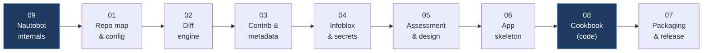

# Nautobot Plugin Research

Code-driven analysis for building a custom IPAM app that must coexist with a
DNS/Infoblox SSoT app on the same `ipam.IPAddress` rows.

Written 2026-08-22 against: nautobot 3.2.4a0, nautobot-app-ssot 4.6.2a0, diffsync 2.2.3a0.
Every claim carries a `file:line` reference — verify anything that looks surprising.

## Where to start

Pick the row that describes you:

| You are… | Read, in order |
|---|---|
| **New to Nautobot** | [09 — Internals](09-nautobot-internals.md) → [01](01-repo-map-and-config.md) → [06](06-plugin-structure-and-standards.md) |
| **Writing app code today** | [09 §9.6 (the save path)](09-nautobot-internals.md) → [08 — Cookbook](08-plugin-cookbook.md) → [06](06-plugin-structure-and-standards.md) |
| **Working on the sync itself** | [02 — Diff Engine](02-diff-engine.md) → [03 — Contrib & Metadata](03-contrib-layer-and-metadata.md) → [08 §8.4-8.7](08-plugin-cookbook.md) |
| **Deciding the design** | [04 — Infoblox Pattern](04-infoblox-pattern-and-secrets.md) → [05 — Assessment](05-assessment-and-design.md) |
| **Shipping it** | [07 — Packaging](07-packaging-and-distribution.md) |



## Contents

| Doc | Covers |
|---|---|
| [09 — Nautobot Internals](09-nautobot-internals.md) | **Background mechanics.** Startup and app loading, the registry, the model layer, the save path, request lifecycle, jobs/Celery, the IPAM data model — with flowcharts |
| [01 — Repo Map & Config](01-repo-map-and-config.md) | Layering, settings override precedence, `NautobotAppConfig` extension points, the `nautobot.apps.*` public API |
| [02 — Diff Engine](02-diff-engine.md) | `DiffSyncModel`, the three-phase pipeline, the 12-line action decision, the attrs-intersection rule, the flag matrix, scaling limits |
| [03 — Contrib Layer & Metadata](03-contrib-layer-and-metadata.md) | `NautobotModel` generic CRUD, field-name syntax, `ObjectMetadata.scoped_fields`, the precedence toolkit, where custom logic goes |
| [04 — Infoblox Pattern & Secrets](04-infoblox-pattern-and-secrets.md) | Multi-grid config model, the IPAM/DNS model split, deletable-models pattern, the full secrets chain, OpenShift/Vault verification |
| [05 — Assessment & Design](05-assessment-and-design.md) | Honest verdict on SSoT completeness, 10 concrete recommendations, open questions for the Nautobot team |
| [06 — Plugin Structure & Standards](06-plugin-structure-and-standards.md) | Copy-pasteable Nautobot app skeleton and dev standards |
| [07 — Packaging & Distribution](07-packaging-and-distribution.md) | Building the wheel, GitHub Releases vs `ghcr.io`, what installing on a foreign Nautobot actually takes |
| [08 — Plugin Cookbook](08-plugin-cookbook.md) | **Start here to write code.** Working samples for every layer: DiffSync models/adapters/jobs, metadata provenance, the ownership guard, symptom→cause debug table |

Docs are numbered by the order they were written, not the order to read them — use the
table above.

## The five findings that matter most

1. **Nautobot core contains zero diff/sync logic.** It all lives in the `diffsync`
   library and the `nautobot-app-ssot` repo. → [01](01-repo-map-and-config.md)

2. **Diff comparison runs over the *intersection* of both sides' attribute keys**
   (`diffsync/diff.py:266-279`). A field not declared in `_attributes` can never be
   written. Field ownership is structural, not configured. → [02](02-diff-engine.md)

3. **`ObjectMetadata.scoped_fields` is a per-field provenance ledger built into core**
   (`nautobot/extras/models/metadata.py:256`), and SSoT populates it automatically from
   `get_synced_attributes()`. This is the answer to the conflict problem, and it is
   better than tags or custom fields. → [03](03-contrib-layer-and-metadata.md)

4. **Infoblox already solves the IPAM/DNS overlap** by defining `IPAddress`,
   `DnsARecord`, `DnsHostRecord`, and `DnsPTRRecord` as four DiffSync types with
   *identical identifiers* and *disjoint attributes* over the same ORM row. `ipaddress`
   deliberately does not declare `dns_name`. Copy this. → [04](04-infoblox-pattern-and-secrets.md)

5. **Secrets are never stored in the database** — confirmed. `Secret` holds only
   `provider` + `parameters`; values are fetched live. The OpenShift claim checks out:
   HashiCorp provider reads the pod's projected service-account JWT from
   `/var/run/secrets/kubernetes.io/serviceaccount/token` and exchanges it for a
   short-lived Vault token. → [04](04-infoblox-pattern-and-secrets.md)

## Traps found in the code

- **`"Last sync from"` vs `"Last Sync from"`** — contrib and integrations create
  *different* `MetadataType` rows. Match case-insensitively. ([03](03-contrib-layer-and-metadata.md))
- **Metadata is opt-in** via `PLUGINS_CONFIG["nautobot_ssot"]["enable_metadata_for"]`
  *and* requires a `NautobotAdapter` subclass. Miss either and you get nothing. ([03](03-contrib-layer-and-metadata.md))
- **`ObjectMetadataAnnotation` hardcodes `scoped_fields = []`**, discarding field
  scoping. ([03](03-contrib-layer-and-metadata.md))
- **`sort_relationships` is disabled** in the main job flow with a "ongoing issues"
  comment (`jobs/base.py:513`). ([05](05-assessment-and-design.md))
- **No conflict resolution exists anywhere in SSoT.** Last writer wins. ([05](05-assessment-and-design.md))
- **Overriding a dict/list setting wholesale replaces it** — the `LOGGING` case skips
  env-var post-processing entirely (`nautobot/core/settings.py:1364`). ([01](01-repo-map-and-config.md))

## Cloned repos

Siblings of this folder, so the `nautobot` working tree stays clean. They are
gitignored - clone them yourself to resolve the `../nautobot/...` paths in these docs:

```
nautobot_training/
├── docs/                                        this folder
├── nautobot/                          3.2.4a0   core (branch: develop)
├── nautobot-app-ssot/                 4.6.2a0   framework + 19 integrations
├── diffsync/                          2.2.3a0   the diff engine
├── nautobot-app-secrets-providers/              Vault / AWS / Azure / Delinea / 1Password
└── nautobot-app-device-onboarding/              second contrib example
```

```bash
git clone https://github.com/nautobot/nautobot.git
git clone https://github.com/nautobot/nautobot-app-ssot.git
git clone https://github.com/networktocode/diffsync.git
git clone https://github.com/nautobot/nautobot-app-secrets-providers.git
git clone https://github.com/nautobot/nautobot-app-device-onboarding.git
```
